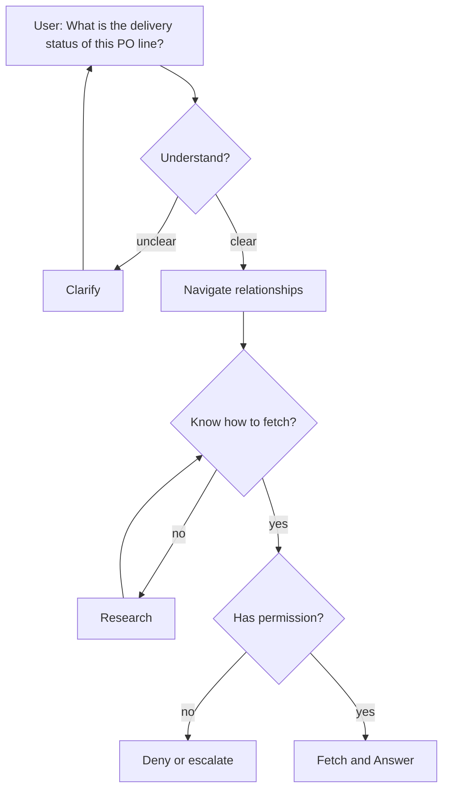
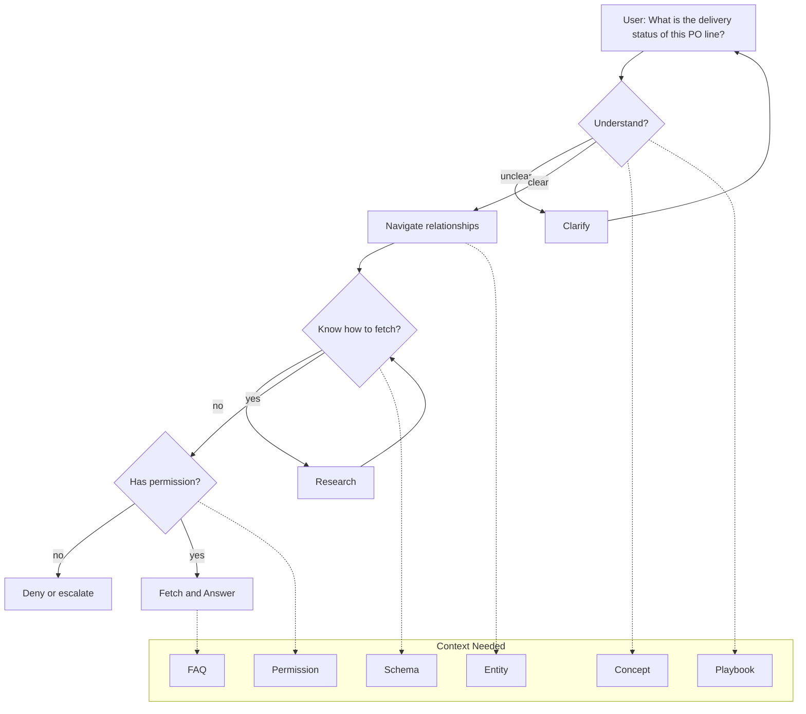
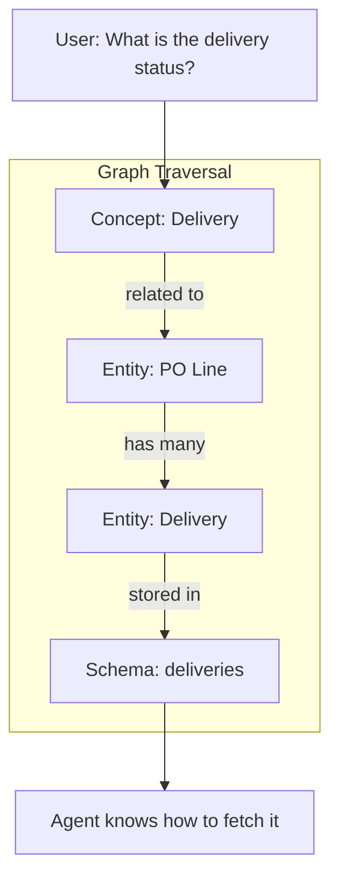
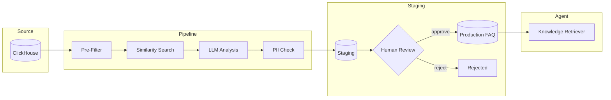

# Context Engineering for AI Agents

*Structuring knowledge so agents can answer like human experts*

---

## From User Question to Human Expert Thinking

**Users ask our agent questions every day:**

- "How does approval workflow work?"
- "Why can't I access this screen?"
- "What's the delivery status of this PO line?"
- "Can you analyze our spending trends?"

**What would a human expert need to answer these?**

**And for behavior:**
- User asks 3 times, agent can't answer → *"Offer to create a ticket"*
- User asks analytics question → *"Think longer, pull multiple sources"*

**A human expert has this from experience. An agent needs it structured.**

---

## Six Types of Context

**Each type serves a purpose in agent reasoning:**

| Type | What It Is | Example |
|------|-----------|---------|
| **Concept** | Domain definitions — what things mean | "Delivery is a shipment linked to a PO Line" |
| **Entity** | Business objects and relationships | PO → PO Line → Delivery → Invoice |
| **FAQ** | Direct answers to common questions | "How does approval workflow work?" |
| **Permission** | Access rules — who can do/see what | "Invoice screen requires FINANCE_VIEWER role" |
| **Playbook** | Agent behavior rules — how to act | "If can't answer 3x → offer to create ticket" |
| **Dataset/Schema** | Technical structures, APIs, fields | `deliveries {id, status, po_line_id, date}` |

**Without these, agent fails:**

| Missing | Failure |
|---------|---------|
| Concept | Doesn't understand the question |
| Entity | Can't navigate relationships |
| Playbook | Doesn't know when to escalate or change approach |
| Schema | Can't fetch the actual data |

**Now we see why — each step in the thinking process needs specific context:**

---

## Why Graph-Based?

**Problem:** Flat search returns matches, not context.

> *Search "delivery status" → FAQ about delivery trucks, wrong table, no connection to PO*

**Solution:** Graph lets agent traverse connections like a human expert would.

**Graph gives us control — LLM context is limited:**

| Need | Strategy |
|------|----------|
| Simple question | **Narrow** — just FAQ |
| Relationship question | **Broaden** — expand entities |
| Complex question | **Combine** — multiple types |

---

## Types Enable Automation

**Knowledge comes from everywhere. Types let us automate ingestion.**

| Source | → | Type |
|--------|---|------|
| Support tickets | → | FAQ ✅ *(already built)* |
| Changelogs | → | Permission |
| Confluence docs | → | Concept |
| Database DDL | → | Schema |

**Types make it easy to extend automation pipeline by pipeline.**

### Example: Ticket → FAQ Pipeline (Already Built)

**Key decisions at each step:**
- **Pre-Filter**: Skip if body < 30 chars, not resolved
- **Similarity**: Skip if > 95% match to existing FAQ
- **LLM**: Decide NEW (create) / MERGE (update existing) / SKIP (not useful)
- **PII Check**: Reject if email/phone detected
- **Human Review**: Final approval before production

---

## The Admin UI

**Humans curate. Agent consumes.**

| Feature | Purpose |
|---------|---------|
| **Graph Explorer** | Visualize connections, spot gaps |
| **Node Management** | Create/edit each knowledge type |
| **Staging Queue** | Review AI-extracted knowledge before publishing |
| **Metrics Dashboard** | What's used, what's stale, what's missing |

---

## Q&A

**Questions?**
